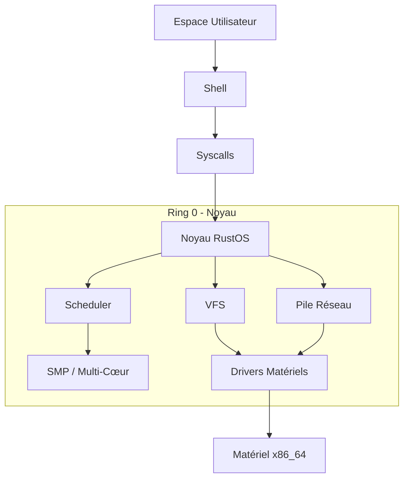

# RustOS


**RustOS** est un système d'exploitation éducatif et minimaliste écrit en Rust, conçu pour l'architecture **x86_64**. Il démontre les concepts modernes de développement d'OS : sûreté mémoire, concurrence sans data races, et modularité.

---

## 🚀 Fonctionnalités Clés

### 🧠 Noyau & Multitâche
- **Symmetric Multi-Processing (SMP)** : Utilisation de tous les cœurs CPU détectés.
- **Multitâche Préemptif** : Planificateur CFS (Completely Fair Scheduler) supportant Threads et Processus.
- **Isolation Mémoire** : Support Ring 0 (Kernel) et Ring 3 (User) avec pagination.
- **Synchronisation** : Mutex, Sémaphores, Spinlocks sans deadlock.

### 💾 Système de Fichiers & Stockage
- **VFS (Virtual File System)** : Abstraction unifiée pour les opérations fichiers.
- **RamFS** : Système de fichiers en mémoire rapide.
- **Support EXT2** : Lecture de partitions EXT2 (en cours).
- **Drivers ATA/SATA** : Accès disque DMA.

### 🔌 Gestionaire de Périphériques
- **Détection Automatique** : Scan PCI, USB, ACPI au démarrage.
- **Plug & Play** : Architecture événementielle pour le hotplug.
- **Drivers** : Clavier, Souris, Réseau (RTL8139), Série, VGA.

### ⚡ Gestion de l'Énergie
- **ACPI** : Extinction (Shutdown) et Redémarrage (Reboot) propres.
- **Économie** : Boucle `hlt` dynamique pour réduire la consommation CPU.

### 🌐 Réseau
- **Pile TCP/IP** : Support IPv4, UDP, TCP, ICMP, ARP.
- **Clients** : DHCP pour configuration auto, DNS pour résolution de noms.

---

## 🛠️ Architecture



## 📝 Documentation

La documentation complète est disponible dans le dossier `docs/` :

- **[Guide de Démarrage](docs/RING3_README.md)** : Installation et premiers pas.
- **[Architecture](docs/ARCHITECTURE.md)** : Vue technique détaillée.
- **[SMP & Power](docs/SMP_POWER.md)** : Détails sur le support multi-cœur et énergie.
- **[Mode Utilisateur](docs/ring3_guide.md)** : Guide du mode Ring 3.
- **[Changelog](CHANGELOG.md)** : Historique des versions.

## 🚀 Démarrage Rapide

### Prérequis
- **Rust Nightly** : `rustup override set nightly`
- **QEMU** : Pour l'émulation (`qemu-system-x86_64`)
- **Bootimage** : `cargo install bootimage`

### Compilation et Exécution

```bash
# Se placer dans le dossier du noyau
cd mini-os

# Lancer dans QEMU
cargo run --release

# Lancer les tests
cargo test
```

## 📊 État du Projet

| Module | Statut | Version |
|--------|--------|---------|
| **Noyau** | ✅ Stable | 1.2.0 |
| **SMP** | ✅ Beta | 1.3.0 |
| **Shell** | ✅ Stable | 1.1.0 |
| **Réseau** | 🚧 En cours | 0.9.0 |
| **Filesystem** | ✅ Stable | 1.2.0 |
| **USB** | 🚧 Alpha | 0.5.0 |

## 🤝 Contribution

Les contributions sont les bienvenues ! Pour commencer :
1.  Forker le projet.
2.  Créer une branche (`git checkout -b feature/AmazingFeature`).
3.  Commit vos changements (`git commit -m 'Add some AmazingFeature'`).
4.  Push vers la branche (`git push origin feature/AmazingFeature`).
5.  Ouvrir une Pull Request.

## 📄 Licence

Distribué sous la licence MIT. Voir `LICENSE` pour plus d'informations.

---

**Développé avec ❤️ par Selim Marouani**
