# 🦀 RustOS


**RustOS** est un système d'exploitation éducatif et minimaliste écrit en Rust, conçu pour l'architecture **x86_64**. Il met en œuvre des concepts modernes de développement d'OS avec une forte emphase sur la sûreté mémoire, la concurrence sans data races, et la modularité.

## 🚀 Fonctionnalités Principales

### 🧠 Noyau & Multitâche
- **SMP (Symmetric Multi-Processing)** : Support multicœur complet avec détection automatique via ACPI MADT
- **Multitâche Préemptif** : Planificateur CFS (Completely Fair Scheduler)
- **Gestion de la Mémoire** : Allocateur de mémoire, pagination, et gestion du tas
- **Synchronisation** : Mutex, Sémaphores, et Spinlocks sans deadlock

### 💾 Système de Fichiers
- **VFS (Virtual File System)** : Interface unifiée pour les opérations sur les fichiers
- **RamFS** : Système de fichiers en mémoire haute performance
- **Support de Systèmes de Fichiers** : EXT2/3/4, FAT32
- **Cache** : Mémoire tampon et prélecture (readahead) optimisés

### 🔌 Gestion des Périphériques
- **Détection Matérielle** : PCI, ACPI, et périphériques plug-and-play
- **Drivers** : 
  - Stockage : ATA/SATA, NVMe avec cache
  - Réseau : RTL8139, pile TCP/IP complète (IPv4, UDP, TCP, ICMP, ARP)
  - Graphique : VESA, VGA
  - Entrées : Clavier PS/2, Souris
  - USB : HID, Stockage de masse
  - Bluetooth : HCI, L2CAP

### ⚡ Gestion de l'Énergie
- **ACPI** : Extinction et redémarrage propres
- **Optimisations** : Boucle `hlt` dynamique pour économiser l'énergie

### 🌐 Réseau
- **Pile Réseau** : IPv4, UDP, TCP, ICMP, ARP
- **Services** : DHCP pour la configuration automatique, résolution DNS
- **Sécurité** : Pare-feu de base, filtrage de paquets

## 🛠️ Architecture

```mermaid
graph TD
    User[Espace Utilisateur] -->|Appels Système| Kernel[Noyau RustOS]
    
    subgraph Noyau
        Kernel --> Scheduler[Scheduler SMP]
        Kernel --> Memoire[Gestion Mémoire]
        Kernel --> VFS[Système de Fichiers]
        Kernel --> Reseau[Réseau]
        Kernel --> Drivers[Gestion des Périphériques]
        
        Scheduler --> Processus[Gestion des Processus]
        Memoire --> Allocateur[Allocateur de Mémoire]
        Memoire --> Pagination[Gestion de la Pagination]
        VFS --> RamFS
        VFS --> EXT2[EXT2/3/4]
        VFS --> FAT32
        Reseau --> TCP_IP[Pile TCP/IP]
        Reseau --> DHCP
        Drivers --> Stockage[Stockage: ATA/NVMe]
        Drivers --> Graphique[Graphique: VESA/VGA]
        Drivers --> Entrees[Entrées: Clavier/Souris]
        Drivers --> USB[USB HID/Stockage]
        Drivers --> Bluetooth
    end
```



## 🚀 Démarrage Rapide

### Prérequis
- Rust (édition nightly)
- QEMU
- `cargo-xbuild`
- `llvm-tools-preview`

### Compilation et Exécution
```bash
# Installer les dépendances
rustup toolchain install nightly
rustup component add rust-src --toolchain nightly-x86_64-unknown-linux-gnu
rustup component add llvm-tools-preview
cargo install cargo-xbuild

# Compiler et exécuter avec QEMU
make run
```

## 📚 Documentation

La documentation détaillée est disponible dans le dossier `/docs` :
- [Guide de démarrage](docs/GETTING_STARTED.md)
- [Architecture du noyau](docs/ARCHITECTURE.md)
- [Développement de drivers](docs/DRIVERS.md)
- [Contribution](docs/CONTRIBUTING.md)

## 🤝 Contribution

Les contributions sont les bienvenues ! Veuillez lire nos [lignes directrices de contribution](CONTRIBUTING.md) pour les détails sur le processus de soumission des pull requests.

## 📜 Licence

Ce projet est sous licence MIT - voir le fichier [LICENSE](LICENSE) pour plus de détails.

## 🙏 Remerciements

- L'équipe de développement de Rust pour un langage incroyable
- La communauté OSDev pour les ressources et le soutien
- Tous les contributeurs qui ont aidé à faire de RustOS ce qu'il est aujourd'hui
        Kernel --> VFS
        Kernel --> NetStack[Pile Réseau]
        
        Scheduler --> SMP[SMP / Multi-Cœur]
        VFS --> Drivers[Drivers Matériels]
        NetStack --> Drivers
    end
    
    Drivers --> Hardware[Matériel x86_64]
```

## 📝 Documentation

La documentation complète est disponible dans le dossier `docs/` :

- **[Guide de Démarrage](docs/RING3_README.md)** : Installation et premiers pas.
- **[Architecture](docs/ARCHITECTURE.md)** : Vue technique détaillée.
- **[docs/SMP_POWER.md](docs/SMP_POWER.md)** - Guide SMP et Énergie
- **[docs/TODO.md](docs/TODO.md)** - Liste des tâches et dettes techniques
- **[Mode Utilisateur](docs/ring3_guide.md)** : Guide du mode Ring 3.
- **[Changelog](CHANGELOG.md)** : Historique des versions.

## 🚀 Démarrage Rapide

### Prérequis
- **Rust Nightly** : `rustup override set nightly`
- **QEMU** : Pour l'émulation (`qemu-system-x86_64`)
- **Bootimage** : `cargo install bootimage`

### Compilation et Exécution

```bash
# Se placer dans le dossier du noyau
cd mini-os

# Lancer dans QEMU
cargo run --release

# Lancer les tests
cargo test
```

## 📊 État du Projet (Réalité Technique)

| Module | Statut Technique | Détails |
|--------|------------------|---------|
| **Noyau** | ✅ Production | SMP, Multitâche, Allocateur Hybride |
| **Réseau** | ✅ Stable | Stack TCP/IP complète (v4), Driver RTL8139 |
| **VFS / RamFS** | ✅ Stable | Opérations fichiers complètes, Cache Dentry |
| **Ext2** | ✅ Intégré | Montage auto (Partition 1) sur Primary Master |
| **UFAT** | 🚧 En Dev | Formatage OK, R/W non implémenté |
| **USB** | 🏗️ Architecture | Détection PCI OK, Transferts non implémentés |
| **Bluetooth** | 🏗️ Architecture | Structures HCI définies, Stack non liée |
| **Shell** | ✅ Stable | Commandes de base, Pipeline, Variables |

## 🤝 Contribution

Les contributions sont les bienvenues ! Pour commencer :
1.  Forker le projet.
2.  Créer une branche (`git checkout -b feature/AmazingFeature`).
3.  Commit vos changements (`git commit -m 'Add some AmazingFeature'`).
4.  Push vers la branche (`git push origin feature/AmazingFeature`).
5.  Ouvrir une Pull Request.

## 📄 Licence

Distribué sous la licence MIT. Voir `LICENSE` pour plus d'informations.

---

**Développé avec ❤️ par Selim Marouani**
